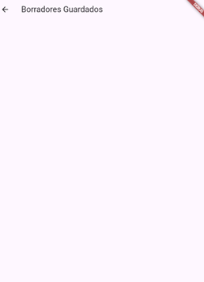

# Nintventario App

## Project Presentation
You can access the project presentation video, which shows a demonstration (in English) of our software system showing the running software components and their compliance with functional and non-functional requirements, here.

## Installation Guide

To install the Nintventario app, follow the steps below:

1. **Download the APK**:
   - Go to the following link: [Nintventario App Release v0.1](https://github.com/Nintventario-Team/NintventarioApp-beta/releases/tag/v0.1)
   - Click on the `Nintventario.apk` file. You don’t need to have a GitHub account to access the file.

   

2. **Download Warning**:
   - If downloading through a browser on your phone, an alert will appear indicating that downloading an app by external means is dangerous with the message "The app could be harmful". 
   - Select the "Download anyway" option. Don’t worry, the app does not contain any harmful software; this is simply an alert that comes by default when downloading applications outside of conventional stores.

3. **Install the APK**:
   - Once the APK file is downloaded, locate it and open it to start the installation.
   - In some cases, it will be necessary to activate the "unknown sources" option to allow the installation.

   

4. **Open the App**:
   - Once the app is installed, look for the icon and open the application.

 

       
       
   

## Mobile Manual

### User Guide for Navigating in the Mobile App

Once we have the mobile app on our device, we should get in it.

**Login**

The first screen that is going to appear when you open the mobile app is the login. Now in development, we have two buttons. The first login is going to be an authentication that is going to let you in only if you have the credentials of a PRICOTERCORP’s employee. The other button is going to let you in without any credentials, so in this case we use the Bypass Login (the button is only there until the development stage is finished)

**Sale Spots screen**

After we login, the app is going to display a list of the sale spots of the company PRICOTERCORP S.A. in this case we can select any commercial center that we are interested in.

**Home screen**

Once we have selected a sale spot, we are going to be directed to the “home page” this screen displays four options.

**Create inventory**

If we select the option “Crear inventario” the app is going to display the list of products with its properties (“ID”, “Anterior Stock”, “Actual Stock” , “Estado”) of the unfinished inventory that the user was working on.

Here are some important points to take into mind. The first element of this page is going to be the search bar, in this tool we can put as an input the name, ID or state of a product and automatically is displaying the related product with the input. As you can see in the next picture:

By selecting confirm you are going to return to the list of products in the inventory applying the changes.

The other part to take in mind are the products that appear in this list, by selecting one of them just pressing on them. The app is going to display the following widget. In the real environment, the main goal of the user is going to change the “current Stock” with the total number of products that are in the local, so, in this widget is possible to do that just introducing the number. And also, in the same way you can modify the others properties.

**Inventory Details screen**

While working on the inventory, you can save drafts to work later. To do this we have to select the option “Detalles” in the bottom bar. After selecting that option, the following screen is going to appear:

Here are the details of the inventory, the ID of the inventory, the name of the person that created the inventory. The inventory duration based on the lapse of time between the creation date and the current date. If everything is okay push the “SAVE DRAFT” button, you should see the following message in the bottom of the screen.

**Inventory Report screen**

Once the inventory is finished, we should go to option “Reporte” in the bottom bar of the screen. After selecting that the next screen is going to be displayed:

Here are going to appear the “inconsistencies” of the inventory, this is going to be helpful to track the advance of the items already checked on the inventory. Once the user feels ready to declare an inventory as finished, we only are going to push the button “FINALIZE” and the app is going to export a report.docx with all the issues.

**Inventory History screen**

In other part, if in the home, we select the option “Historial” the App is going to display a list of the previous inventories with its state (finished or working)

**Inventory settings screen**

In other part, if in the home, we select the option “Ajustes” the App is going to display the following settings: the notification, account settings, and the version of the app.

The selection of the option “About” is going to show the information of the App and its developers.

**Inventory Log out screen**

Finally, the option “salir” is going to close the app.

